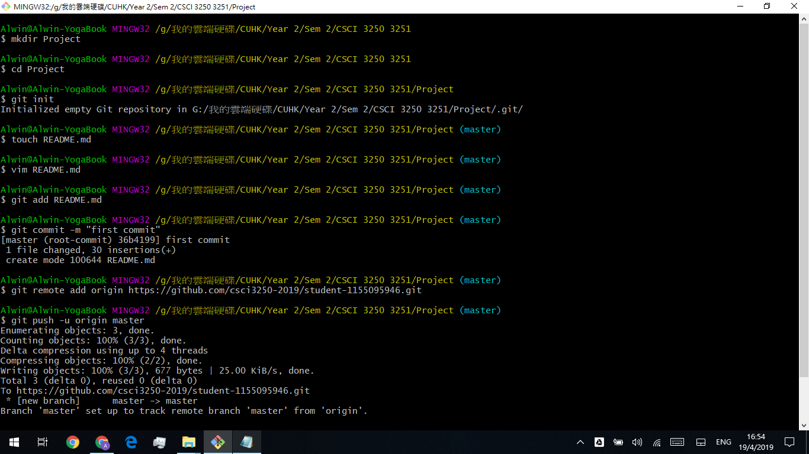
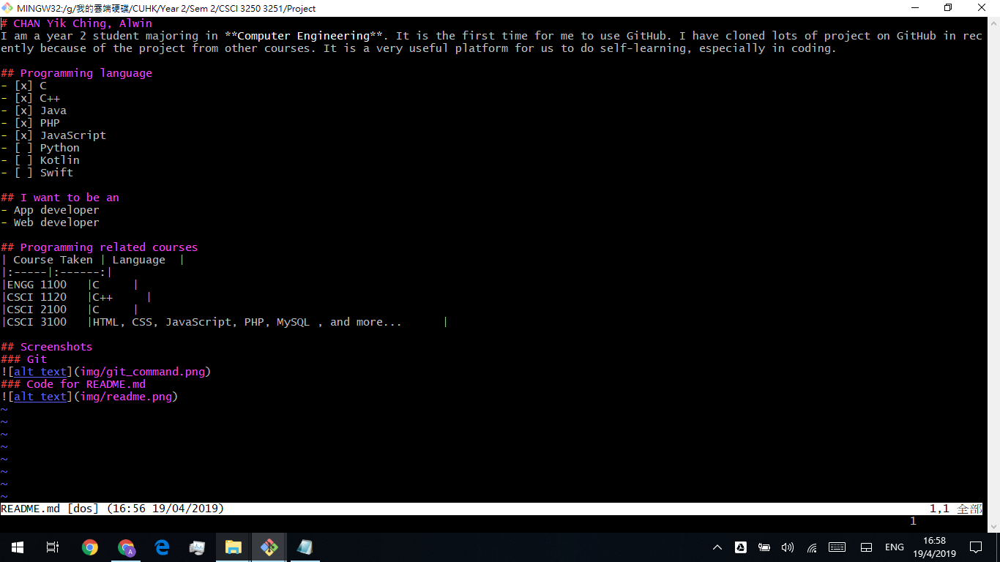

# CHAN Yik Ching, Alwin
I am a year 2 student majoring in **Computer Engineering**. It is the first time for me to use GitHub. I have cloned lots of project on GitHub in recently because of the project from other courses. It is a very useful platform for us to do self-learning, especially in coding.

## Programming language
- [x] C
- [x] C++
- [x] Java
- [x] PHP
- [x] JavaScript
- [ ] Python
- [ ] Kotlin
- [ ] Swift

## I want to be an
- App developer
- Web developer

## Programming related courses
| Course Taken | Language  |
|:-----|:------:|
|ENGG 1100   |C     |
|CSCI 1120   |C++     |
|CSCI 2100   |C     |
|CSCI 3100   |HTML, CSS, JavaScript, PHP, MySQL , and more...      |

## Screenshots
### Git

### Code for README.md

